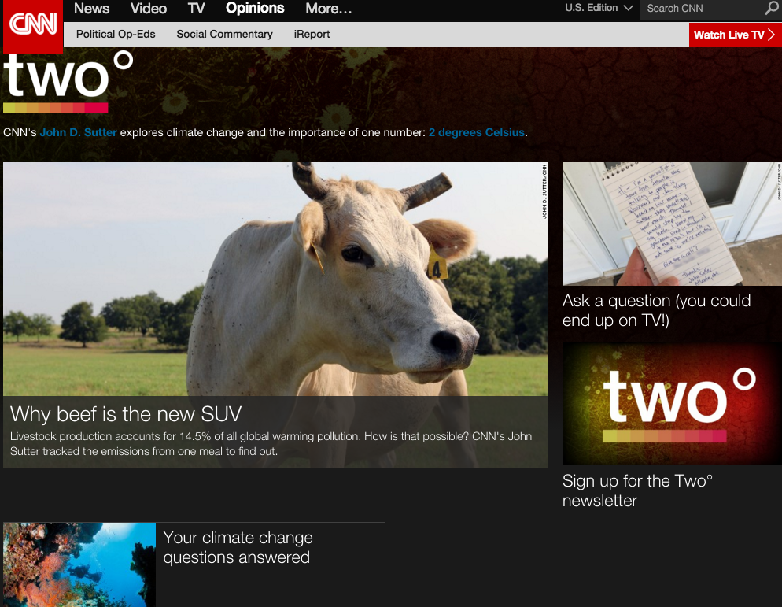
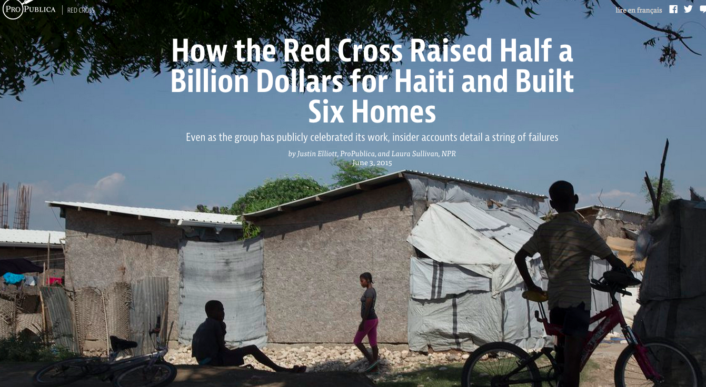
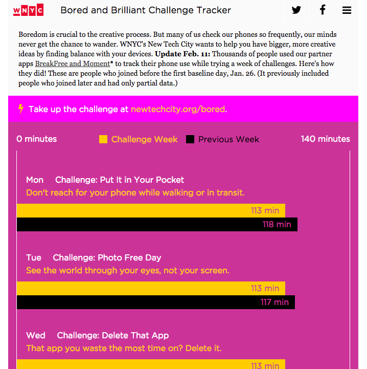

***Acknowledgements***

We would like to thank the Tow Center for Digital Journalism at
Columbia University for supporting our research. Emily Bell, Liz Boylan,
and, in particular, Claire Wardle were an unending source of wisdom,
support, common sense, and encouragement. Claire’s expertise in
eyewitness media and her clear vision have been immensely valuable.

Our research also benefited greatly from the generosity of our
interview subjects, who opened up their schedules and minds to tell us
of their triumphs and challenges in this brave new world. To a person,
they were thoughtful and candid, and we regret that we could not record
every word here to mark and celebrate their contributions.

We are also grateful to those crowdsourcing experts who had already
paved the way for our research—both those whom we interviewed and those
we didn’t—whose work has nonetheless been instrumental in bringing this
practice to where it is today. 

Finally, we offer special thanks to a group of people that has
unknowingly and significantly affected this report: the community
members who have contributed to crowdsourcing projects, giving their
time and energy to build a campaign finance database, share what they
paid for medical procedures, or create a living compendium of all the
people killed by police in the United States. You, community
contributors, have demonstrated faith in journalists and a belief that
we can work together to create journalism of great substance and
meaning.

*November 2015*

Executive Summary
=================

### The Purpose of the Research

The term “crowdsourcing” has been around for a decade. Although Wired
writer Jeff Howe coined it in 2006, the ways in which news organizations
define and employ it today vary enormously.

This guide is organized around a specific journalism-related definition
of crowdsourcing and provides a new typology designed to help
practitioners and researchers understand the different ways
crowdsourcing is being used both inside and outside newsrooms. This
typology is explored via interviews and case studies.

During our research, we interviewed 51 people, analyzed 18 survey
responses, engaged in online explorations of dozens of projects, and
developed four in-depth case studies.

### Definition and Typologies

**Our definition**: Journalism crowdsourcing is the act of specifically
inviting a group of people to participate in a reporting task—such as
newsgathering, data collection, or analysis—through a targeted, open
call for input; personal experiences; documents; or other contributions.

Using that definition, most crowdsourcing generally takes two forms:

-   An unstructured call-out, which is an open invitation to vote,
    email, call, or otherwise contact a journalist with information.

-   A structured call-out, which engages in targeted outreach to ask
    people to respond to a specific request. Responses can enter a
    newsroom via multiple channels, including email, SMS, a website, or
    Google form. Often, they are captured in a searchable database.

We argue that crowdsourcing requires a specific call-out. If a newsroom
simply harvests information or content available on the social web, we
don’t believe this constitutes crowdsourcing. For us, the people
engaging in crowdsourcing need to feel they have agency in contributing
to a news story.

We acknowledge that crowdsourcing efforts don’t fit neatly into discrete
classification, but for the purpose of this report, we’ve organized our
typologies into six different calls to action:

-   **Voting**—prioritizing which stories reporters should tackle.

-   **Witnessing**—sharing what you saw during a news event.

-   **Sharing personal experiences**—telling what you know about your
    life experience.

-   **Tapping specialized expertise**—contributing data or unique
    knowledge.

-   **Completing a task**—volunteering time or skills to help create a
    news story.

-   **Engaging audiences**—joining in call-outs that can range from
    informative to playful.

### Principal Findings

-   The rise of crowdsourcing correlates with the rise of the Internet
    and web technologies that have made it easier for journalists to
    identify and cultivate communities; organize data; and follow
    real-time, breaking-news developments.

-   Crowdsourcing leaders, like *The Guardian* and ProPublica, believe
    in the practice and integrate it thoroughly.

-   Some stories involving specialized data or unique personal
    experiences can be told only via crowdsourcing.

-   Crowdsourcing allows newsrooms to build audience entry points at
    every stage of the journalistic process—from story assigning, to
    pre-data collection, to data mining, to sharing specialized
    expertise, to collecting personal experiences and continuing
    post-story conversations.

-   News organizations are taking different paths toward audience growth
    and engagement. Some are focusing on crowdsourcing; others are
    interested in mining non-solicited citizen contributions through
    social media.

-   Good crowdsourcing efforts are high-touch, labor-intensive efforts.
    Journalists must determine a type of call-out, the communities to
    target, the method for collecting responses, and the avenues for
    connecting and giving back to the community of contributors.

-   News organizations must demonstrate active engagement and reward the
    community during the crowdsourcing process, by actively
    participating in comments or updating contributors on a story’s
    progress, to encourage more contributions.

-   Some organizations have created additional venues, such as Facebook
    Groups, to continue the conversation.

-   Tension exists in some news organizations around whether
    crowdsourced contributions are trustworthy. Experienced
    practitioners say this is not a problem.

-   For digital-first startups, in particular, crowdsourcing provides a
    way to cultivate new audiences from scratch and produce unique
    journalism.

-   Some news organizations are situating crowdsourcing out of newsrooms
    and within communities.

-   Several crowdsourcing ventures are turning into bona fide
    businesses, offering B2B (business-to-business) crowdsourcing
    solutions to media companies.

-   News consumers clearly have stories to share, but they don’t
    necessarily want to write the news.

-   Ways of measuring the impact of engaging in crowdsourcing
    initiatives and analyzing its value to a newsroom are still in
    development. Such measures have not been institutionalized.

### Conclusion

The research shows that crowdsourcing is credited with helping to create
amazing acts of journalism. It has transformed newsgathering by
introducing unprecedented opportunities for attracting sources with new
voices and information, allowed news organizations to unlock stories
that otherwise might not have surfaced, and created opportunities for
news organizations to experiment with the possibilities of engagement
just for the fun of it.

In short, it has done just what the pundits predicted a decade ago:
helped turn journalism into more of a conversation, rather than a
one-way megaphone.

Crowdsourcing also deserves credit for shaping journalism into more of
an iterative process: as data or stories come in from contributors,
reporters see new possibilities for their journalism—and news
organizations see opportunities to incrementally publish those
contributions in ways that tease out more.

Certainly, though, crowdsourcing can be high-touch and high-energy, and
not all projects work the first time.

For all its potential, crowdsourcing’s promise is widespread and
systemic at just a few big news organizations—ProPublica, WNYC, and *The
Guardian*, for example. At other mainstream news organizations, like CNN
Digital and *The New York Times*, only a handful of reporters and
editors—and not the institutions themselves—are the standard bearers.

To be sure, crowdsourcing businesses are flourishing outside of
journalism. But within the news industry, wider systemic adoption may
depend on more than enthusiasm from experienced practitioners and
accolades from sources thrilled by the outreach.

We would like to see more research and evidence exploring whether
crowdsourcing can foster greater support for journalism. That support
might take the form of audience engagement, such as attention, loyalty,
time spent on a site, repeat visits, or contributing personal stories.
Or it might mean financial support from members or donors, from
advertisers who want to be associated with the practice, or from funders
who want to support it.

Also to be explored is whether crowdsourced stories have more real-world
impact, such as prompting legislative change, than other types of
journalism do.

Until this data is available and a better suite of tools and practices
is developed, some news organizations may be wary of joining the ranks
of long-time practitioners and investing the time and resources needed
to support crowdsourcing projects

Introduction
============

When health care reporter Elisabeth Rosenthal needed to find patients
for her stories, she stood in a hospital parking lot looking for the
right prospects. “It’s kind of low-yield and it’s cold,” she remembered.
But when she tackled a series for *The New York Times* on the cost of
U.S. medical care two years ago, she tried a new approach. “Obviously, I
needed patients,” she said.

A simple invitation to readers on February 11, 2013, opened the door to
finding sources that populated the 10 stories of her award-winning
“Paying Till It Hurts”.[@Paying] She queried: “Have you had a hip
replacement? Tell us about your costs and bills.” And 512 readers
responded.

Soon, responses multiplied—addressing the costs of colonoscopies,
pregnancies, emergency room visits, and more. Rosenthal tapped these
street-level views to craft many of her stories. “It really changed my
view of how crowdsourcing could give you insight,” she said. Although it
was not that long ago, her use of crowdsourcing—reaching out to ordinary
people to capture their experiences on her subjects—was a teachable
moment for *The New York Times*. Rosenthal recalled that the news
organization had few templates for how to frame the questions she asked
or where to place them on a web page, and few tools for searching the
responses. It also provoked discussion on what the policy should be for
emailing and thanking contributors, and even whether to permit a public
Facebook page for a growing community that wanted to stay engaged.

Two years later, many of those issues have been resolved. Rosenthal’s
crowdsourcing led to the creation of a database of some 12,000
contributors that New York Times reporters can now use, and a Facebook
Group with more than 6,500 members.

Her discovery of the potential for capitalizing on community experiences
represents far more than an isolated event. It fits neatly into a larger
trend of newsrooms’ willingness to increasingly embrace the role that
the crowd can play in gathering and contributing information.

*Wired* writer Jeff Howe was the first to spotlight this trend in a 2006
article, wherein he anointed this kind of activity as
“crowdsourcing.”[@Howe] But the ways in which news organizations have
come to define and employ it since vary enormously.

This guide is organized around a specific, journalism-related definition
of crowdsourcing and articulates a new typology designed to help
practitioners and researchers understand the different ways it is being
used both inside and outside newsrooms.

In exploring how crowdsourcing is evolving in the media ecosystem, we
asked journalists about the kinds of jobs crowdsourcing is helping them
to accomplish. We interviewed 51 people, analyzed 18 survey responses,
and engaged in online explorations of dozens of projects. We also
developed in-depth case studies of particularly successful crowdsourcing
protocols at four news organizations, which helped to identify key
elements of effective projects and their outcomes in terms of
participation and impact. By no means does this guide capture all
journalism crowdsourcing to date. A number of different initiatives by a
range of organizations could populate the categories in this report, if
space permitted.

Almost daily, some news organization reaches out to the public for help
in reporting a story. Sometimes that request is fun and engaging for the
respondents, like WNYC’s [Subway Agony
Index](http://www.wnyc.org/story/your-subway-agony/).[@SubwayAgony]
Sometimes the news organizations seek to capture what people witnessed
during a catastrophe or a breaking news event, such as the Boston
Marathon bombings. At other times, it mines deep wells of social
injustice or taps personal histories of pain and suffering, as in
[ProPublica’s “Patient
Safety”](https://www.propublica.org/series/patient-safety)
series.[@Safety] At the highest level of engagement, news organizations
ask people to do work for them, as did *The Guardian*’s [MPs’
expenses](http://www.theguardian.com/politics/mps-expenses)
story.[@MPExpense]

The goal of such initiatives is to get people to share what they know
individually so that journalists can communicate the collective
information. With social media now deeply inculcated in most newsrooms,
these so-called “call-outs” have become easier than ever to promote.
What has become harder is managing both the front end and back end of
invitations for public contributions that can generate hundreds, even
thousands, of responses.

While many newsrooms pay lip service to its benefits, crowdsourcing
finds itself at the intersection of the markedly different paths news
organizations are charting to engage and grow audiences. For some,
crowdsourcing is the epitome of authentic interaction and community
building. Others prefer a less onerous strategy of harvesting audience
input from social media channels.

We argue, however, that crowdsourcing requires a specific call-out. If a
newsroom simply uses information or content already available on the
social web, we don’t believe this constitutes crowdsourcing. For us, the
people engaging in crowdsourcing need to feel they have agency in
contributing to a news story.

In the following report, we give a brief history and definition of
crowdsourcing, before describing how it is being used—both inside and
outside of newsrooms. We then outline some typologies that we have found
useful for grouping crowdsourced efforts and expand on those with
interviews and case studies.

A Brief History of Crowdsourcing in Journalism
----------------------------------------------

It wasn’t long after Jeff Howe applied the term crowdsourcing to
developing stories with public input that the label began to populate
the journalistic lexicon.[@Howe] It was a new millennium when journalism
thought-leaders urged news organizations to rethink their relationship
with news consumers.

Dan Gillmor saw the news transforming from a lecture into a conversation
and advocated for tapping the wisdom of the crowds in his 2004 book [We
the Media](http://www.oreilly.com/wethemedia/).[@Gillmor] “My readers
know more than I do, and that’s a good thing,” he said. Jay Rosen, in
his [seminal 2006 blog
post](http://archive.pressthink.org/2006/06/27/ppl_frmr.html), set forth
the idea of the “people formerly known as the audience” who were now
creators, not merely consumers, of news.[@Rosen]

One of the first news organizations to excel at crowdsourcing was The
News-Press, a Gannett paper in Fort Myers, Florida. In 2006, the paper
asked people to help it figure out why water and sewer assessments were
skyrocketing. The response [astonished
editors](http://www.crowdsourcing.com/cs/2006/11/the_new_investi.html).
[@FortMyers]

“Phones rang off the hook. We learned that if you are going to ask
people to ‘come join us,’ you better be prepared to receive them,” one
of the editors, MacKenzie Warren, said in a report about the initiative.
[@FortMyers] “We had no idea of the level of angst waiting to be
unleashed,” he said. The newspaper’s online forum—where the
crowdsourcing was happening—attracted more than 6,000 submissions. One
of them was a critical, leaked report.

Then in 2007, a startup D.C. blog, [“Talking Points
Memo,”](http://www.nytimes.com/2008/02/25/business/media/25marshall.html?_r=3&oref=slogin&ref=todayspaper&pagewanted=print&)
cracked a scandal involving the firing of U.S. Attorneys General under
political circumstances. Editor Joshua Micah Marshall not only pursued
tips from readers, he gave them assignments, like poring over a mass of
documents (including some 3,000 emails) released by the
administration.[@talkingpoints]

By 2008, the term crowdsourcing was attached to other kinds of
contributions, including so-called citizen journalism or user-generated
content (UGC) coming chiefly from eyewitnesses at the scene of breaking
news. In a [2008 *Nieman
Reports*](http://niemanreports.org/articles/the-wisdom-of-the-crowd-resides-in-how-the-crowd-is-used/)
article, Howe heralded the “wisdom of the crowd” in sharing eyewitness
news and photos about the Southeast Asia tsunami, the terrorist bombing
of the London subway, and the devastation of Hurricane Katrina.[@Nieman]

That same year, Jeff Jarvis
[argued](http://buzzmachine.com/2008/04/14/the-press-becomes-the-press-sphere/)
that journalism was increasingly becoming an activity or process, rather
than a commodity or a product, and part of that process involved news
consumers: “Stories and topics become molecules that attract atoms:
reporters, editors, witnesses, archives, commenters, and so on,” he
wrote.[@Jarvis]

Before long, crowdsourcing was attached to such UGC initiatives as CNN’s
iReport, which sets assignments and asks the community to submit photos
and videos. The crowdsourcing label was also applied to The Huffington
Post’s “Off the Bus,” which, in 2008, served as a home for
citizen-created, presidential campaign coverage. It soon attracted
controversy when blogger Mayhill Fowler gained entrance to a closed
Obama fundraiser as a donor and then wrote about his remarks, igniting a
media firestorm. By 2013, GuardianWitness was inviting reader
participation on featured assignments through its website and a
dedicated smartphone app.

In their 2012 report “Post-Industrial Journalism,” Emily Bell, Clay
Shirky, and C.W. Anderson advanced current thinking: “What’s going away
are the linearity of the process and the passivity of the audience . . .
as citizen involvement stops being a set of special cases and becomes a
core to our conception of how the news ecosystem can and should
function.”[@Tow] Writing about the future of news in 2014 for the
*Columbia Journalism Review*, Dean Starkman found consensus around the
idea that the “utility of crowdsourced journalism—volunteers gathering
or sorting through news—is real and so far really limited.” The
potential, he said, remains “untapped but large.”[@CJR]

Definition
----------

Crowdsourcing means many different things to different people. Much as
citizen journalism is now used to refer to everything from eyewitness
accounts to hyper-local startups launched by individuals, crowdsourcing
has become conflated with other terms.

Some think all comments on stories are crowdsourcing. Others use the
term for any user-generated content. Some regard crowdsourcing as
synonymous with distributed reporting, collaborative journalism,
networked journalism, participatory journalism, and social journalism.
Still others regard the act of harvesting people’s comments or images
from social media channels as crowdsourcing. To be sure, all of these
phenomena share attributes.

Amanda Michel, *The Guardian*’s senior editor of strategy and
partnerships, believes that the very language around crowdsourcing has
shifted in response to changes in the way that the practice is viewed.
“The term ‘citizen journalist’ was once used in a pejorative way . . .
Language is contested and debated within journalism. I think that
reflects more about the world of journalism than about what the words
mean.” Though it may be prudent to, as Michel put it, “focus less on the
language than the phenomenon,” we found it necessary to work with a more
focused definition of crowdsourcing so as to better define and make
sense of specific practices and typologies.

**Our definition**: Journalism crowdsourcing is the act of specifically
inviting a group of people to participate in a reporting task—such as
newsgathering, data collection, or analysis—through a targeted, open
call for input; personal experiences; documents; or other contributions.

Though examples of inviting people to participate in reporting tasks
date back well before the term crowdsourcing was coined, what sets
crowdsourcing apart is the fact that it is fueled by web technologies.
As many of our examples illustrate, crowdsourcing relies upon the role
that the Internet and new digital tools have played in giving
journalists and communities direct and ongoing access to one another.

The community, of course, is used for many purposes: from Yelp’s
crowd-powered collection of reviews on everything from restaurants to
doctors, to crowd labor platforms such as Mechanical Turk, and
humanitarian projects like Ushahidi’s efforts to track relief efforts in
the Haiti earthquake.

This study focuses on crowdsourcing activities that lead to news stories
by professional reporters that appear online, on the air, or in print.
Excluded are projects that involve comments *after* publication of a
story and exchanges of information within a Facebook Group—unless these
were active components of crowdsourcing to create the story. While we
give a nod to sites like Reddit, they are at the margins of our focus.
“I would see crowdsourcing as being something solicitous—sourced from
the crowd,” said Sasha Koren, former *New York Times* deputy editor of
interactive news. Added Sona Patel, *The New York Times*’s senior social
strategy and UGC director:

> Crowdsourcing is the means of getting information. UGC is how we
> display or present it. I like to think of crowdsourcing as us reaching
> out to readers in some directed way. Crowdsourcing is different than
> just mining information.

Using our definition, most crowdsourcing generally takes two forms:

-   An unstructured call-out, which is an open invitation to vote,
    email, call, or otherwise contact a journalist with information.

-   A structured call-out, which engages in targeted outreach asking
    people to respond to a specific request. Responses can enter into a
    newsroom via multiple channels; including email, SMS, a website, or
    Google form. Often, they are captured in a searchable database.

Crowdsourcing in Newsrooms
==========================

Crowdsourcing has gained momentum as web technologies have changed the
nature of journalistic work. Journalists can now quickly and seamlessly
identify and track communities, organize data, follow real-time
developments in breaking stories, and imagine a type of journalism that
is less transactional and more about relationships. For digital-first
startups, in particular, crowdsourcing provides a means of cultivating
new audiences from scratch and producing journalism that delivers a more
pronounced value proposition.

From roles at *The New York Times* to his current position as *The
Guardian*’s executive editor of digital, Aron Pilhofer has observed how
crowdsourcing has shifted from a new idea to something much more solid,
usable, and integrated:

> Within newsrooms, crowdsourcing has become a recognized specialty.
> Reader submissions are a source, just like any other. A bad story idea
> and a bad crowdsourcing idea will end up a bad story or bad
> crowdsourced piece of journalism. There’s no magic to it, it’s a
> source just like anything else.

Pilhofer partly attributes crowdsourcing’s increasing normalization and
effectiveness to how thinking, conventions, and tools within the field
have matured. “Things that in 2009 were novel—like progress bars
indicating the headway contributors had made—are more and more becoming
recognized as necessary,” he said, although they are still not
prevalent.

Crowdsourcing has ardent advocates who say it adds tiers of value to the
process of journalism. It can lead to better journalism, surprising
stories, and communications with audiences that have life long after the
news stories appear.

“I think you get a more diverse pool of voices. I think it builds
connections with readership and, ideally, loyalty with readership,” said
Koren, recalling efforts at *The New York Times*. “There’s a lot to be
said for bringing readers into coverage and asking their opinions of
things.” ProPublica’s crowdsourcing initiatives build pipelines directly
to the people who are affected, noted senior engagement editor Amanda
Zamora. “We are creating lists of consumers interested in our stories.”
Still, there are tensions within the industry about the use of
crowdsourcing. Some fret about giving the audience too much sway over
what their newsroom covers. Others worry about the accuracy of the
contributions citizens make—a concern that long-time users dismiss as a
non-issue with crowdsourced submissions, unlike with user-generated
content. Many investigative reporters, in particular, balk at
telegraphing their intentions through an open call for contributions,
with ProPublica representing a major exception.

Others hesitate about committing the resources. Done well, crowdsourcing
is a high-touch enterprise. Journalists must strategize about the type
of call-out to make, the communities to target for outreach, the method
for collecting responses, and the avenues for connecting and giving back
to the community of contributors. That is all before the contributions
are even turned into journalism.

While some digital startups like ProPublica have bet their futures on
crowdsourcing, other news organizations have set their sights elsewhere.
The Associated Press, for one, pioneered advances in user-generated
content, but it has since moved from targeted call-outs to sourcing
content through social streams and using analytics tools such as
SocialFlow, Dataminr, and NewsWhip to follow themes and stories with a
goal of helping the AP bolster its coverage.

“It’s a subtle but important move from plucking out good stuff to
support our content, to seeing the flow of conversation in social as a
source and using that data to develop stories for the AP,” said Jim
Kennedy, the AP’s senior vice president of strategy and enterprise
development. *The New York Times*, too, has shifted focus. From 2011 to
mid-2014, crowdsourcing was a “huge part of our work,” recalled Sasha
Koren, then-deputy editor of interactive news. But after *The New York
Times* [Innovation
Report](http://mashable.com/2014/05/16/full-new-york-times-innovation-report/#fLsAGSD30Oq4)[@Innovation]
surfaced in May 2014, attention zeroed in on social media and audience
development, said Koren, who took a buyout at the end of 2014. Still,
individual reporters and desks at the news organization do structured
call-outs.

Likewise, the crowdsourced platform that *The Washington Post* launched
in 2012 is currently dormant. “We tried it. It was pretty successful for
its time,” said Greg Barber, the Post’s director of digital news. “But
it had some problems not of its own creation,” including some
“jerry-rigged” tools. Now Barber is working with *The New York Times*
and Knight-Mozilla Open News on the [Coral
Project](https://coralproject.net/),[@Coral] which has tasked engineers
with building open-source software that aspires to be the Holy Grail for
kickstarting and managing news interactivity and user engagement.
Crowdsourcing, said Barber, “is a main course on our menu of
aspirations.”

So where is crowdsourcing happening? Beat reporters at these news
organizations often spearhead their own projects. Niche news startups
featuring hyper-local news, commuter information, or health care use it
to build out their communities of interest. And many digital-first
outlets see it as key to unlocking better journalism and a community of
supporters.

Some say there is a strong business case to be made for crowdsourcing
done right. They assert that loyal and engaged consumers are much more
valuable than itinerant advertisers. While there are promising clues, no
one has made a firm business case yet that inviting audience members to
be sources directly impacts the bottom line as much as it strengthens
the journalism.

Jim Schachter, vice president for news at WNYC, a crowdsourcing leader,
said the engagement levels seen in crowdsourcing help the station get
grants and bolster its outreach to donors. He wrote in an email:

> The business case (though secondary) is real. Someone who has
> undertaken a task for the WNYC community, or a sub-community, has
> demonstrated a deep engagement with us. That person seems on the face
> of things to be likelier to donate or become a member than someone who
> doesn’t have that link to our community. More tactically, we use our
> crowdsourcing efforts to gather email addresses from participants who
> volunteer them—and that allows us to follow up, in appropriate and
> carefully designed ways.

He added: “WNYC’s ingenuity in community engagement creates
opportunities of all kinds by underscoring that we work on the cutting
edge of media innovation.” In particular, Schachter credits
crowdsourcing with helping to secure major grants from the Charles
Revson and Robert Wood Johnson Foundations, as well as a grant to fund
the hiring of WNYC’s first Washington correspondent.

Jennifer Brandel, who spearheaded the Curious City initiative, said that
inviting Chicago’s WBEZ listeners to vote on which stories were assigned
brought in highly engaged people who were new to the station. Of the
more than 5,000 emails the assignment series collected, 56 percent were
not in WBEZ’s customer database, she said. Unlike Curious City,
Brandel’s new platform, Hearken, offers citizens asking questions of
newsrooms an “opt in” button so those email addresses can be added to
newsroom CRMs. ProPublica’s Zamora believes that correlating
crowdsourced participation with revenues is still a task at hand. “We
have a theory that smaller, more targeted audiences generate more reach
and spend more time on the site, but this is something we want to
measure and analyze over the next year,” she said. She recently
recruited more than 100 media professionals to join a new [Crowd-Powered
News
Network](https://docs.google.com/forms/d/170joKlpiLfn8qlnT7lxSJgJKq1IDg_KVilezkbE68U0/viewform)
to share tools and techniques.[@CPNN]

Recently, the Knight Foundation awarded multimillion-dollar grants to
support audience engagement efforts at both ProPublica and The Coral
Project, signaling philanthropic interest in tools for audience
participation.

Moreover, businesses based on crowdsourcing are increasingly populating
the media landscape. Crowdsourcing ventures such as Public Insight
Network, Hearken, and ClearHealthCosts.com are offering B2B
crowdsourcing solutions to media companies. CleverCommute.com is also
offering B2C crowdsourcing on train delays for New York City commuters
and creating information for news outlets.

At least one business has leveraged journalism crowdsourcing to attract
investors. Amanda Hesser, former food editor of *The New York Times
Magazine*, left her job to launch Food52.com with partner Merrill
Stubbs. Community members send in recipes, comment on recipes, ask and
answer cooking questions, enter contests, and send in blog posts. Among
the premises, Hesser said, was “trusting that there were a lot of people
out there who had valuable things to share.” Her site gathers
contributions“fairly organically” via editors reaching out to people
engaged in its social media channels. Since its start in 2009, Food52
has raised \$9 million in capital, employs 55 people, and tracks five
million visitors a month. Also, crowdsourcing apps like WXXI’s Yellr,
the recipient of an innovation grant from INN.org, are being developed
to make it easier for news organizations to issue call-outs via mobile
phones and collect audience responses.

Journalism Crowdsourcing Out of the Newsroom
============================================

Some news organizations are seeing the benefit of situating
crowdsourcing outside of the newsroom and directly within communities.
Its ability to flourish external to the newsroom stems from two factors:
shifts in web tools and culture.

The same online tools that enable news organizations to readily interact
with their audiences have made it easier for those audiences to connect
and self-organize with others.

Meanwhile, culturally, journalism has become more collaborative. “There
was a massive change from 2009 and 2012 in terms of the amount of people
and groups of people who were asking public interest questions and had
spaces to be able to do that,” said former *Guardian* journalist Paul
Bradshaw. This turn toward collaboration paved the way for Help Me
Investigate, Bradshaw’s own crowdsourced journalism website.[@HMI] The
site was created with the goal of providing a platform for citizens and
journalists to work together to investigate questions in the service of
the public good. It took on hundreds of issues.

Though Help Me Investigate shut down in 2014, Bradshaw is convinced that
what made the website so noteworthy was the very fact that its work was
deliberately independent of a newsroom. “You might not need a news
organization. People are organizing on their own,” he said.

In Europe, a group of journalists has been experimenting with innovative
ways of collaborating and using crowdsourced data to produce stories
that would otherwise be left untold. In 2014, five southern European
journalists, led by data journalist Jacopo Ottaviani, banded together to
create Generation E.

Generation E fills in the blanks about the generation of young Europeans
who leave the southern half of the continent and migrate to other
European countries. To collaborate across countries, the team sought
partnerships with large newspapers in its members’ home countries of
Greece, Italy, Spain, and Portugal. When the three-month project ended,
over 2,400 young European migrants had participated. The project
successfully showed the limitations of European governmental data and
challenged stereotypes surrounding reasons for southern European
migration.[@GE]

Each of these cases shows that crowdsourcing can work both inside and
outside of news organizations.

For this reason, we find it not just useful but necessary to examine
more deeply the different forms that crowdsourcing takes. Because so
many diverse practices are qualified as crowdsourcing, categorization
grants us the ability to differentiate between these practices and
highlight the specific characteristics unique to each. From a research
perspective, this permits a better understanding of crowdsourcing as a
whole; from a practitioner’s perspective, it facilitates better
understanding of how best to design successful initiatives.

Typologies
==========

All of our typologies position journalists as what former BBC journalist
and media scholar Charlie Beckett called enablers of content rather than
privileged gatekeepers.[@Beckett] And they acknowledge [the position of
Darren
Brabham](https://dbrabham.files.wordpress.com/2012/09/brabham-2012-ics-the-myth-of-amateur-crowds.pdf)
from USC-Annenberg that crowdsourcing is not just a hobby. Real work
gets done. In architecting types, we wrestled with whether to arrange
efforts by goals (the overall objective of the effort) or tasks (the
calls to action needed to reach that objective). In truth, nearly every
example of crowdsourcing has overlapping tasks and goals. And despite
different models, “the community strategy is the same: increase
participation by serving a target audience with original content that
they find helpful and useful,” said ProPublica’s Zamora.

One thing our list makes clear: News organizations are creating entry
points for audience input at every stage of the crowdsourcing
process—from story assigning, to pre-data collection, data mining,
sharing specialized expertise, collecting personal experiences, and
continuing post-story conversations.

So while we acknowledge that projects don’t fit neatly into discrete
classifications, we’ve devised the following categories based on the
invitation to contribute, or call to action:

1.  **Voting**—prioritizing which stories reporters should tackle.

2.  Witnessing—sharing what you saw during a breaking news event or
    natural catastrophe.

3.  **Sharing personal experiences**—divulging what you know about your
    life experience[12]. “Tell us something you know that we don’t
    know.”

4.  **Tapping specialized expertise**—contributing data or unique
    knowledge. “We know you know stuff. Tell us the specifics of what
    you know.”

5.  **Completing a task**—volunteering time or skills to help create a
    news story.

6.  **Engaging audiences**—joining in call-outs that range from
    informative to playful.

Voting
------

On the bell curve of building news stories, one of the earliest on-ramps
for participation involves simply asking people to vote on the
journalism they want undertaken.

[Curious City](http://curiouscity.wbez.org/)[@Curious] in Chicago has
been crowdsourcing questions that WBEZ public radio listeners want
answered for a couple of years. Here’s how it works: Listeners submit
questions. The newsrooms curates them. Voters select from three
questions at a time. Top vote-getters are turned into stories, and the
person who proposed the question is often invited on the newsgathering
journey.

In the project’s first two years, WBEZ received about 5,000 questions
that generated some 250 stories. Curious City founder Jennifer Brandel
said it was common to get 2,000 to 3,000 votes in any voting round. “Our
stories on average generally outperformed stories from the field” in
terms of metrics, she said. Now, Brandel is taking the show on the road
as CEO of a startup called
[H](http://www.wearehearken.com/)earken[@Hearken] (because WBEZ owns the
Curious City name). Hearken costs a newsroom about \$5,000 a year
depending on the outlet’s size. Brandel hopes to have 30 newsrooms on
her roster by the end of 2015.

In a slightly different vein, [MuckRock](https://www.muckrock.com/) has
launched two reporting initiatives—a drone census and a census on
[biometric
surveillance](https://www.muckrock.com/news/archives/2015/aug/04/street-level-surveillance-who-using-mobile-biometr/)—by
first inviting people to offer road maps for filing FOIA requests. In
the drone census, it asked people to fill out a form, sharing contact
information for local police departments and government agencies
suspected of acquiring drones. The first phase led to 350 FOIA requests
and some 20 stories, including how [Georgia
Tech](https://www.muckrock.com/news/archives/2013/jan/24/georgia-tech-police-wanted-fly-surveillance-drone-/)[@Drone]
was looking to use drones as a “force multiplier” at special events,
such as home football games. “We ultimately got about 1,000 people”
participating, said MuckRock’s founder Michael Morisy. A new
crowdsourcing campaign launched in August 2015 seeks to discover how
local enforcement agencies are using biometric
surveillance.[@surveillance] At issue: how do people think local police
departments are tracking your facial features, your fingerprints, your
DNA—and even your tattoos? Meanwhile, for several years now CNN Digital
has asked for input about which stories to cover—often on social or
climate issues.

### Case Study—CNN Digital

CNN Digital columnist John D. Sutter shepherded two major crowdsourcing
projects in the last couple of years, and the audience input he
collected prompted the American Society of News Editors to award him the
2015 Batten Medal.

In June 2013 he launched CNN’s [Change the
List](http://www.cnn.com/specials/opinion/change-the-list) project,
asking people to bring change to the “bottom of the list.” He invited
people to pick five stories from a list of 20 they wanted him to tackle.
Seven days and 32,546 votes later, he had his tally. On top was a story
about America’s widening rich-poor gap, which got 16,789 votes—nearly
half the total.

“At the time, that really surprised me in terms of stories people would
be clamoring to read about,” he said. However, as his reporting
progressed, he added, “I really saw how central that is to what’s going
on in this country.”

The other [top-voted
topics](http://www.cnn.com/2013/06/18/opinion/sutter-ctl-vote-results/)
also surprised him.[@column] They paved the way for stories about the
poor kids of Silicon Valley, the world’s most-trafficked mammal (the
pangolin), why Alaska is the national epicenter for rape, and America’s
most endangered river (California’s San Joaquin). Plus, he generated a
list of [97 other suggested
topics](http://www.cnn.com/2013/06/14/opinion/sutter-ctl-97-ideas/index.html?hpt=hp_c4).[@column]

Sutter confessed that only 9 percent of the voters wanted to read about
the country with 100,000 new cases of leprosy per year, which would have
been his “top pick.”

“This is journalism as democracy—rebalanced to give you power,” he told
contributors in a
[column](http://www.cnn.com/2013/06/18/opinion/sutter-ctl-vote-results/index.html).[@column]
Sutter said his aim is to get readers more invested in stories they
might otherwise ignore, such as certain social justice issues.

He also acknowledged that the feedback wasn’t all positive. Some “have
tweeted me that this is ‘not journalism’ because the story-selection is
crowdsourced. Others called it a gimmick or a marketing ploy,” he
wrote.[@column] Still others thought they should have been asked to
submit whatever story ideas they wanted, rather than voting from a list.

Either way, Sutter said in an interview, “I think there was real wisdom
in the crowd.” In mid-August 2015, he launched a new crowdsourcing
project, [Two
Degrees](http://www.cnn.com/specials/opinions/two-degrees). It focuses
on “the most important number you’ve never heard of.” Namely, how to
avoid a global temperature rise of 2 degrees Celsius, which is regarded
as the threshold for “dangerous” climate change. The project was an
intended lead-up to climate talks in Paris at the end of 2015.

First, Sutter asked which climate “villains” he should write
about—voters could pick from four suggestions. The winner, again to his
surprise, was animal agriculture (3,942 votes). “I was surprised people
knew about it and wanted to hear about it,” he said. “People are
concerned about greenhouse gas emissions, with eating meat especially,”
he said. Globally, he noted, livestock contribute only about 14.5
percent of all these emissions.

Sutter does most of his call-outs on Facebook, Twitter, and in his
columns. He’s learned to shorten the time frame between when people
first vote on the topics and when the stories actually appear. This
allows people to realize they had a stake in making them happen. And he
notes that CNN has invested a lot of resources in his reporting. He has
traveled to Southeast Asia, Alaska, the Marshall Islands, and Silicon
Valley.

For Sutter, crowdsourcing these story lists has been “central” to his
CNN work for the last couple of years. “We don’t know everything that’s
important in the world,” he said. “We need to do a better job of
listening” to citizens.

Plus, he said, “It’s taken me to topics I would not have done.”

 Witnessing
-----------

News organizations find it highly useful to seek out information and
images from people who have personally witnessed breaking news
situations. However, they’re also increasingly plucking these call-outs
for eyewitness contributions from social media channels.

Examples include shared images and information from the Nepal
earthquake, Hurricane Katrina, the Fukushima nuclear accident,
Superstorm Sandy, Andy Carvin’s Twitter coverage of the Arab
Spring,[@Carvin] and WNYC’s [crowdsourced
photos](http://www.wnyc.org/story/105465-2-mapping-storm-clean/) of
shoveled show during the 2010 New York City blizzard.[@Storm]

At the [Watershed Post](http://www.watershedpost.com/), a digital-first
news website in New York’s Catskills region, co-founders Julia Reischel
and Lissa Harris made national news in 2011 when Hurricane Irene
barreled through, flooding entire villages, washing out highways and
bridges, and cutting off communications. “The only way to keep an eye on
our coverage area was to have a distributed network of people feeding us
information,” Harris said, adding that official sources were largely
absent on the communications front. Similarly, as Hurricane Irene was
zeroing in on New Jersey, urban planner Justin Auciello launched [Jersey
Shore Hurricane
News](https://www.facebook.com/JerseyShoreHurricaneNews), a Facebook
page that crowdsourced information not only to produce news, but also to
come to the aid of local communities.With user input, Auciello reported
who needed help, where people could get water or generators, where they
could find their lost dogs, and how they could find family members. The
page went from 20,000 likes in its first four days to 65,000 some 14
months later, October 2012, on the eve of Superstorm Sandy. JSHN now has
225,000 Facebook likes and more than 10,000 Twitter followers.
Eyewitness crowdsourcing is also taking root in the area of
citizen-science journalism. In 2011, when climate journalist Julia
Kumari Drapkin found herself struggling to connect esoteric scientific
results with on-the-ground topics that could engage local communities,
crowdsourcing emerged as a way to bridge the gap. “It’s difficult to
scale down from global time and space to any individual person’s story
or local community’s experiences,” Drapkin said. “It wasn’t like I
wanted to be a crowdsourcer. It was more like, ‘This is a problem that I
think the crowd could help solve.”’ She did this through her
Colorado-based KVNF public radio venture
[iSeeChange](https://www.iseechange.org/).[@iSeeChange] Drapkin
collected local observations and solicited community questions about
environmental changes people were seeing, then brought in scientists to
answer those questions. Some of these conversations foreshadowed
large-scale natural events. For instance, when a local fire department
official shared observations about fire season beginning earlier and
lasting longer, scientists and researchers corroborated the official’s
insights, which he shared three months before the epic 2012 Colorado
wildfire season.

“A lot of science disregards the anecdote,” Drapkin said. “However, when
you’ve lived in the same place for your whole life and you can say,
‘Hey, I’ve never see this before,’ more often than not those moments are
opportunities to bring data to researchers and wonder if it isn’t
something to pay attention to.”

 Sharing Personal Experiences
-----------------------------

Several news organizations have developed a suite of stories by issuing
both structured and unstructured call-outs to targeted communities.
While they might maintain a general outline of the stories they want to
do, they seek contributions that may change the narrative, reveal
surprising trends, uncover unknown sub-groups, or point to discrete
stories for coverage.

Honolulu’s [Civil
Beat](http://www.civilbeat.com/projects/living-hawaii/), for instance,
crowdsourced part of its “Living Hawaii” series, publishing
[first-person
narratives](http://www.civilbeat.com/projects/living-hawaii/%5D) from
residents. “Nothing is more common in Hawaii than struggling with the
cost of living,” said deputy editor Eric Pape. “It’s so damn expensive
here. This allows people to say, ‘Here’s my story about this.’” Civil
Beat also invited first-person narratives and opinion about the conflict
over Mauna Kea, a dormant volcano where scientists are looking to build
a telescope on what many residents consider sacred land. Pape said the
topic reflects the differences of opinion in Hawaii about a number of
issues: how people think about native Hawaiians, money, nature, science,
etc. “It’s a sweet spot for us,” Pape said. “We are here to highlight
problems and obstacles to solutions, as well as possible solutions.”
Sometimes these crowdsourcing efforts begin such robust conversations
that news organizations take an additional step and create venues such
as Facebook pages for continued discussions after the stories are
produced.

During Elizabeth Rosenthal’s work on health care costs, *The New York
Times* eventually permitted a Facebook Group page that now has more than
6,500 members. Rosenthal acknowledges that it’s an open page where any
journalist can lurk and mine story ideas just as she does. “I think my
editors feel that’s fine. But that was a discussion,” she said.
Similarly, [Pro Publica’s Patient Safety Facebook
Group](https://www.facebook.com/groups/patientharm) of more than 3,300
members[@Group] grew out of
[reporting](https://www.propublica.org/series/patient-safety) by
Marshall Allen, Sisi Wei, and Olga Pierce that found one million people
each year suffer harm when treated in the U.S. health care
system.[@Safety] They explored everything from dangerous dialysis
centers, to unsafe hospitals, to surgical complications in operating
rooms.

Overall, ProPublica has been a leader in eliciting personal
contributions that help structure new narratives.

### Case Study—ProPublica

No other U.S. news organization has cultivated the art of crowdsourcing
like ProPublica. With patience and acumen, the eight-year-old nonprofit
startup has both embraced a unique mindset and developed a robust
toolkit to transform enterprise journalism.

The mission, simply put, is to “find people in the know,” said Amanda
Zamora, senior engagement editor who has spearheaded ProPublica’s
crowdsourcing efforts in recent years. That is accomplished by building
“getting involved” on-ramps, and soliciting sources and contributions
through formal call-outs. It also entails cultivating source communities
with high-touch communication and dynamic givebacks.

“It’s sort of like we’re building a tree. We plant one and it’s very
skinny, but we soon get a sense of whether it’s about to grow,” she
said. ProPublica’s mindset is all about transparency and collaboration.
“One thing ProPublica is not afraid to do is to investigate in the
open,” said Charles Ornstein, who credits crowdsourced contributions for
advancing many of his health care stories, including Dollars for Docs
and experiences with the Affordable Care Act. “You sort of announce what
you are working on. It’s sort of scary letting other people know. But
you are also staking your turf.” Last year, ProPublica moved away from
Google Forms because it needed to better organize the vast amounts of
data it was gathering. As of mid-September 2015, Zamora counted at least
37 call-outs since 2009 that generated 10,953 responses just from
surveys. Another 13,400 people have signed up to participate in other
ways.

ProPublica found a solution in Screendoor, a database tool built to
handle government requests for proposals. “We’ve taken their RFP
platform and turned it into a story platform,” Zamora said.

Over the years, crowdsourcing has contributed to an array of ProPublica
news exclusives focusing on patient safety, nursing home inspections,
its Surgeon Scorecard, and more. Input comes via call-outs and
questionnaires and also through its “Reporting Network” of volunteers
who engage in reporting tasks such as reviewing political ad spending in
its Free the Files project.[@Files]

ProPublica deploys both structured and unstructured solicitations to
collect personal stories and documents, identify sub-groups with stories
to tell, and build communities of stakeholders.

Here’s how one recent structured call-out worked. In late June 2015,
Charles Ornstein and *The Virginian-Pilot*’s Mike Hixenbaugh wanted to
explore the effects of Agent Orange on Vietnam veterans and their
children. They also wanted insights on stories they didn’t know about.

So, ProPublica invited service members and their families to share their
experiences. Ornstein wrote an advance story, then ProPublica went to
work issuing call-outs for information on its website, in social media
channels, and in a podcast. It also mined veterans’ communities—even the
websites of naval ships dispatched to the war zone.

In the first 12 weeks, more than 2,900 people responded. “This is an
extraordinary response,” Ornstein said. “People want to share their
stories. They’ve been waiting for this opportunity.”

Screendoor captured their stories in its highly searchable database.
Terry Parris Jr., ProPublica’s community editor, began to solicit
documents to verify dates of service, wrangle photos, and record audio
stories. “I’m on the frontlines of the community coming in,” he said. By
mid-September, the crowdsourcing helped generate an early story on a
subset of stakeholders: the Blue Water Vets, who were being denied
benefits because they sailed not in the brown waters of Vietnam’s inland
waterways but in the blue waters of the seas off Vietnam, where they
likely drank Agent Orange-polluted water.

Not all of ProPublica’s crowdsourcing efforts involve requests to
complete questionnaires. In fact, significant stories by Justin Elliott,
Jesse Eisenberg, and NPR’s Laura Sullivan on Red Cross relief spending
during the 2012 Superstorm Sandy and the 2010 Haiti earthquake initially
engaged in an unstructured call-out. Essentially, the journalists urged
readers to email Justin “if you have experiences with or information
about the Red Cross, including its operation after Sandy.”

Only a few emails arrived at first, until ProPublica reported that the
Red Cross was fighting its FOIA request to the N.Y. Attorney General
because the information might potentially disclose “trade secrets.” More
sources weighed in, leaked documents arrived, and people urged the
reporters to look into Haiti relief spending as well.

“There’s no way we would have gotten the tips we got without that [email
us] line,” Elliot said. “People need a nudge. Just because of Sandy,
I’ve been adding these lines to everything I’ve written.”

The ProPublica/NPR reports raised questions about how the Red Cross
spent millions in donations raised for victims. One impact: recently
proposed federal legislation requiring the charity, which has a
government-mandated disaster-response role, to open its operations to
outside oversight.

“Universally, these are people who worked for or volunteered for the Red
Cross for a long time,” Elliott said. “They cared a lot about the
organization and thought there were unethical decisions . . . might be
some management incompetence or mismanagement of money.”

Said Zamora, “Every reporter who has worked on a call-out will tell you
they found sources or insights that substantively impacted their
stories.”

One outcome of ProPublica’s crowdsourcing is “we have way more stories
and sources than we can use,” said Zamora, who wants to “catalyze other
reporting” by making that data available to journalists who want to find
their own stories in it.

Screendoor will play a role in managing that network of reporters
because it can identify contributors by location. The database, said
co-founder Clay Johnson, sends an immediate acknowledgement to a
contributor. It allows ProPublica to filter and rate responses, add
comments into the responses, send a note to a specific sub-group of
people, track the emails sent, and share all project updates with
participants in a personalized way.

“I can say, ‘Dear Barry,”’ Ornstein said. “You told us you have cancer,
diabetes, or [suffered from] a heart attack.”

Zamora also plans to use it to “dynamically expose pieces of the story”
through vignettes, pull quotes, or audio clips from contributors so
ProPublica can continue giving back to the community and tease out more
input while the crowdsourcing process is ongoing. Next up: ProPublica is
partnering with Yelp in a project to align Yelp’s “qualitative reviews
with ProPublica’s objective data” on medical services, Ornstein said. He
added that the partnership will give ProPublica access to Yelp’s
“firehose” of more than a million reviews. The Knight Foundation
recently awarded ProPublica a \$2.2-million grant to help advance its
audience engagement work and train others in its techniques. “I feel we
are just on the cusp of finally being able to realize what I’ve wanted
to do,” Zamora said.

 Tapping Specialized Expertise
------------------------------

In some instances, journalists recognize that they have gaps in
knowledge that are hard to fill with standard reporting techniques.
Sometimes that’s because data may be buried in privacy policies or
trade-secret lockboxes.

As ProPublica developed its “Patient Safety” series, it particularly
tapped a sub-group of health care providers to help it develop its
[Surgeon
Scorecard](https://projects.propublica.org/surgeons/).[@scorecard] The
scorecard calculated death and complication rates for surgeons
performing one of eight elective procedures under Medicare.

Several public broadcasters have been in the vanguard of using
crowdsourcing to gather health care data from individual consumers. Most
recently, KQED in San Francisco, KPCC in Los Angeles, and WHYY in
Philadelphia asked hundreds of listeners to share specific prices they
paid for certain medical procedures. The results helped others in those
cities compare prices that different providers charged.(Read more on the
[Tow Center’s
blog](http://towcenter.org/crowdsourcing-in-theory-and-practice) about
the newsrooms’ partnerships with ClearHealthCosts.com, which was founded
by Jeanne Pinder, a co-author of this report.)

When the International Consortium of Investigative Journalists (ICIJ)
landed massive troves of leaked documents that were too big for one news
organization to analyze alone, they tapped members around the world to
leverage their knowledge of local individuals and entities whose names
appeared in the data. “Maybe we would call it a more structured kind of
crowdsourcing,” said ICIJ deputy director Marina Walker Guevara. “We
take steps to carefully select our crowd.” ICIJ’s first big disclosure,
[Offshore Leaks](http://www.icij.org/offshore), published in April 2013,
involved 100 journalists from 60 countries examining 2.5 million records
of some 130,000 offshore accounts, according to a case study of the
initiative.[@Buzenberg] The stories made transparent who owned covert
companies and private trusts, often used to dodge taxes. ICIJ later put
some of the information in a [public
database](http://www.icij.org/offshore/search-offshore-leaks-data),
subsequently used by more than 400 reporters to develop their own
stories. ICIJ went on to develop two more initiatives—Lux Leaks and
Swiss Leaks—with selective crowdsourcing from scores of
journalists.[@Buzenberg]

Completing a Task
-----------------

At times, news organizations need help performing specific journalism
jobs that they don’t have the resources to do themselves, so they issue
call-outs to volunteers. ProPublica, for instance, tasked citizens with
poring over records of campaign advertising in its notable Free the
Files project, and it asked for volunteers to call all 535 members of
Congress to help report who was getting free [Superbowl
perks](http://www.propublica.org/getinvolved/item/propublicas-super-bowl-blitz-which-congressmen-are-getting-super-bowl-perks).[@perks]

D. Brian Burghart built his
[FatalEncounters.org](http://www.fatalencounters.org) database with more
than 8,800 cases of “people killed during interactions with law
enforcement” by calling for volunteers to submit incidents and verifying
those and others with web research and public records requests.
Australia’s ABC runs ABC Open,[@ABCOpen] an example of a traditional
news organization thinking creatively about using crowdsourced methods
to reach previously untapped communities. ABC Open is a participatory
media project that sends over 45 producers out to hold digital-skills
workshops for rural Australians. The intent of the initiative is to
provide Australians outside metro areas with an opportunity to tell
stories. ABC Open encourages them to contribute stories to its website
with periodic story prompts. Since 2010, about 12,000 people have shared
some 80,000 submissions.

In ABC’s news division, an interactive team led by Matt Liddy collected
a year’s worth of a metadata from the phone of an ABC reporter and
tasked its audience with uncovering insights by exploring the data. The
high-bar effort, intended to show audience members how phone metadata
can tell stories, resulted in over 400 people sifting through the data
themselves and writing to ABC News with their findings.[@ABCNews]

Still, the journalistic leader in tasking volunteers with crowdsourced
requests has been *The Guardian*. Since 2009, it has tapped into the
power of its audience base, expertly finding ways to work
collaboratively with its large and active audience. As time has passed,
*The Guardian* has learned how to target specific communities with clear
asks, while simultaneously broadening the types of answers it is open to
receiving. The result is a seamless, back-and-forth interaction that
benefits all parties.

### Case Study—*The Guardian*

In 2009, *The Guardian* established itself as a frontrunner in
crowdsourced journalism with its famous MPs’ expenses experiment: the
organization created a searchable database of thousands of MPs’ spending
receipts and asked the public to help mine the dataset for interesting
information.

The experiment was a resounding success. Over 20,000 volunteers searched
more than 170,000 documents, setting a new standard for the potential of
crowdsourced journalism to produce high audience engagement and tangible
journalistic outcomes.

In the six years since, crowdsourcing has become an integral part of
*The Guardian*’s strategy, said Oliver Laughland, senior reporter at
*The Guardian U.S.* “The journalists who work here have [crowdsourcing]
ingrained in their consciousness. We’re always trying to think about
ways in which you can engage with the audience and make them part of
it.”

*The Guardian*’s latest effort, The Counted, exemplifies this.[@Counted]
The Counted is an attempt to track the number of people killed by police
and law enforcement agencies in the United States. It aims to provide a
database that is currently at the center of national attention due to
recent high-profile citizen deaths at the hands of police and security
officers.

For [The
Counted](http://www.theguardian.com/us-news/series/counted-us-police-killings),
Laughland said the role of the audience was even more crucial than
usual. “We knew The Counted wouldn’t work without it.” The Counted lives
at the intersection of crowdsourced data collection and traditional
reporting methods. In many cases, the team starts with data reported by
members of the community, then gives that data to reporters to verify
and extend. Occasionally the situation is reversed: a journalist will
call up local police departments or medical examiners to create a data
point that is updated as more information comes in from the crowd.

The result is that The Counted includes a number of stories that are
outside the reach of both smaller and larger news organizations, and the
campaign has the resources to report on stories that otherwise would
have fallen through the cracks. “From a traditional reporting
perspective, you can report on cases that haven’t captured national
attention before,” Laughland said, citing five or six deaths that had
not yet been reported.

Mary Hamilton, audience editor at *The Guardian U.S.*, said these
stories are told primarily by reaching out to specific, interested
communities rather than the organization’s general audience. As a
result, journalists’ existing ties to community networks were
instrumental for initially spreading the word.

The team also has a distributed email list with semi-regular updates,
and a project Facebook page and Twitter account that share news on
police killings and make appeals for information on specific cases. All
of these accounts feed into the
[interactive](http://www.theguardian.com/us-news/ng-interactive/2015/jun/01/the-counted-police-killings-us-database),[@MPExpense]
where the team has been meticulous about the tone and language they use.
“Join our community” is the phrase they’ve adopted precisely for its
emphasis on inclusion and action.

Keeping momentum going during a year-long effort is daunting, but
Hamilton credits two factors for the team’s ability to continually
engage its audience: regularly adding new content (in the form of
updates to the email list, Facebook page, Twitter account, and online
interactive) and an element of reward.

Every single tip the team receives is viewed, counted as significant,
and responded to, Hamilton said. “You can’t have a meaningful,
long-lasting crowdsourced project without this type of acknowledgement.”

The Counted was also designed to support multiple entry points through
which community members can engage and submit information. Hamilton
noted that different mediums yield different types of information. On
Twitter, the team is more likely to receive links. The Facebook page
generates a mix of submissions: community members have more space to
talk about leads they might have or to engage in conversation with other
world-be contributors.

Hamilton said the most meaningful information often comes from the Tips
Form on *The Guardian*’s website. It is here that family members or
members of the deceased’s legal team will provide fleshed-out stories
and accounts. Submissions through the Tips Form have been so well
detailed that they have led, on occasion, to published Op-Eds on *The
Guardian*’s main site.

Users usually travel across the different platforms before eventually
settling on one. “They tend to gravitate to whatever they’re most
comfortable with,” Hamilton said.

As of September 2015, The Counted has reported over 837 people killed by
U.S. law enforcement agencies, with many of those cases reported
entirely because of the project’s crowdsourced element. As Hamilton
said, “Our readers collectively can scour far more than we can. They’re
fantastic at holding us to account and making sure that our reporting is
accurate.”

But there are costs. “This takes resources,” she noted:

> This is a significant amount of work for my team . . . It’s at least
> two hours a day every day, including weekends—all the moderating,
> going through submissions, responding. The journalism has to be
> updated, has to continue to live after the launch point. The community
> engagement part is work, just as much as writing the story in response
> to the community engagement is. Resourcing that carefully is hugely
> important, and that work is often invisible.

One of the major takeaways is that successful crowdsourcing demands
work, time, and effort. “Crowdsourcing and engagement aren’t an
afterthought,” Hamilton said. “You don’t build the journalism and then
decide how you’re going to do an engagement effort. You have to plan it
from the start. It’s not the icing. It has to be baked in.”

Engaging Audiences
------------------

Not all crowdsourcing is intended to produce investigative series, build
sophisticated databases, or tease out powerful narratives from people
with knowledge of something reporters want to pursue.

Many news organizations are making it a priority to connect with their
audiences in ways that are as much fun and engaging as they are
informative. Others connect with real-time, useful information.

“Whenever we have active weather, crowdsourcing is at the heart of what
we do,” said Jason Samenow, *The Washington Post*’s weather editor. He
is also chief meteorologist for the Post’s Capital Weather Gang,
marshaling contributions from its 180,000 [Twitter
followers](https://twitter.com/capitalweather?ref_src=twsrc%5Egoogle%7Ctwcamp%5Eserp%7Ctwgr%5Eauthor)
and 66,600 Facebook fans. During snowfalls, “people send us pictures of
their rulers in the ground,” he said. Likewise, the for-profit NYC’s
CleverCommute.com is now transitioning hundreds of thousands of email
contributors to a new app that will collect their alerts on real-time
commuter train hiccups and relay them to New York’s huge commuter train
community and local media clients. Public broadcaster WNYC is one of the
standouts in crowdsourcing its listeners about everything from the
useful (e.g., has the city snow-plowed your street yet?) to the
whimsical (e.g., what is your sleep pattern?). “We need to be good at
this because it’s the source of very valuable content,” said Jim
Schachter, WNYC’s vice president for news. Public radio, with its
well-received call-in shows, is uniquely situated to develop call-outs
that command a lot of contributions, as well as donors. “In Bored and
Brilliant, we asked you to build a replica of your dream house out of
the contents of your wallet and then take a picture of it and share it
with us,” Schachter said. “If you’re willing to do all that work, it’s a
fairly small ask of us to say, ‘Will you be a member?”’

### Case Study—WNYC Public Radio

WNYC public radio in New York specializes in crowdsourcing with intense
community engagement. Recent projects have tasked listeners with
tracking soil temperatures to predict when cicadas would emerge from the
ground, to assessing their sleep patterns and encouraging them to turn
off their mobile phones and test their creativity in its Bored and
Brilliant challenge.

What’s the secret? “It has to do with purposefulness and a reasonably
active effort to learn from what we’ve done in the past,” said Jim
Schachter, WNYC’s vice president for news. “When we launched into the
sleep project, we were thinking what worked and didn’t work in the
cicada project. And when we launched Bored and Brilliant, we were
thinking what worked and didn’t work in sleep and cicada.”

Part of the station’s secret sauce? Its popular Brian Lehrer morning
call-in show.

“We have a call-in show and host that for 25 years have been honing how
to pose questions to people so the board will light up and Brian won’t
be there talking to himself,” Schachter said. “I don’t want everybody
else to start a talk show because our secret weapon would be stolen. But
if every newsroom acted like it had one, what would it be like for that
newsroom?”

Integral to many projects is John Keefe, senior editor for data news. A
journalist with technical skills, Keefe was central to the [Cicada
Tracker project](http://project.wnyc.org/cicadas/), which provided
directions on how to build a soil-temperature measuring
device.[@Cicadas] Ultimately, 1,500 temperature readings came in, many
from people who built the tracker themselves. In the 2014 project [Clock
Your
Sleep](http://www.wnyc.org/story/clock-your-sleep-findings/)[@Sleep]
almost 5,000 people signed up to log sleep patterns for several weeks,
either online, with a Fitbit or other device, or by using WNYC’s iPhone
app built for the project.

The project had multiple on-air appearances because, Keefe said, “For a
longer study, you need a reminder.”

[Bored and
Brilliant](http://www.wnyc.org/series/bored-and-brilliant/)[@Bored]
enticed people with a week of challenges to put away their cell phones
and “take part in a semi-scientific experiment to test your creativity.”
The project nudged people to reclaim the time they spend on their phones
and use it instead to let their minds wander “and see what brilliance it
may lead you to.” One challenge, a photo-free day, urged people to ‘see
the world through your eyes, not your screen.’”

“It was an activity you could do yourself and it made you think about
the topic,” Keefe said. More than 20,000 people took part.

While much of WNYC’s work focuses on engagement rather than
investigations, hard news also plays a role. In [Mapping the Storm
Cleanup](http://www.wnyc.org/story/105548-2-mapping-storm-clean-/), WNYC
sought to truth-check Mayor Michael Bloomberg’s assertion that
snow-shoveling had been effective city-wide after a 2010
blizzard.[@Storm]

WNYC invited listeners to text if their streets had been plowed. “We
could map the no’s vs. the yeses. And since we had their phone numbers,
we could text them back the next day, or two days later, and say, ‘Is
your street plowed now?”’ Keefe said. The result: a series of maps with
pins, white for unplowed and blue for plowed. Over three days of
mapping, the pins turned from white to blue.

“It’s easy to get people to participate if they’re angry,” Keefe said.
“It’s harder . . . if it’s benign.”

In September 2010, when New York City shifted from using voting machines
to paper ballots that were marked by a voter and then scanned into a
machine, WNYC launched [Your New Ballot
Stories](http://www.wnyc.org/story/94305-text-ballot-your-primary-day-reports/),
expecting ballot design to be a big issue.[@Ballot]

The station asked people to sign up before the vote so it could text
them on voting day and, if they voted, invite them to tell what
happened, or to leave a voice message that could be used on the air.

As it turned out, ballot design was not the biggest issue. Instead,
voters expressed concerns about ballot privacy after being asked to hand
their ballots to poll workers for scanning. “The privacy issue popped
up, and that was our story right away,” Keefe said.

Accuracy is sometimes an issue, Keefe noted, and WNYC has certainly
rejected some projects because they are not accurate enough. After
Hurricane Sandy, he said, WNYC thought about crowdsourcing which gas
stations had gas, but didn’t: first, because it couldn’t ensure the
information would be accurate, and second, because people might use
their last gas to get to a station, only to be disappointed. “It’s too
fragile a situation to crowdsource,” he said.

That journalistic sensibility, infused with humility, lies at the heart
of WNYC’s crowdsourcing.

“That’s what it’s about,” Schachter said. “It’s a genuine expression of
humility that the audience, however you’re defining it for a particular
endeavor, knows more than you do—and it’s to be listened to. That’s
really important.”

Verification and Legal Issues
=============================

Many news outlets say they’re not comfortable trusting information that
arrives via crowdsourcing. But those who are deeply engaged in the
process say accuracy is seldom a problem. Newsrooms will undertake
verification as needed. When ProPublica, for instance, uses an Agent
Orange story from a Vietnam veteran, it takes care to ask for records
documenting military service. But when WNYC asks about your sleep
patterns, verification is not necessary.

Crowdsourcing does open doors to some legal issues. In building a
crowdsourcing project, it’s important for a news organization to
establish terms and communicate how community contributions will be
used.

“When you’re soliciting information, you get to set the terms,” said
Jennifer Dukarski, a media attorney at Butzel Long’s Ann Arbor,
Michigan, office. “When they send stuff back to you, you can use it in
any way that you told them you’re going to use it.” Most crowdsourcing
practitioners advise being clear about your plans for the stories and
data you collect.

Likewise, if a news outlet is capturing and using pictures or videos
from Twitter, Facebook, Instagram, or another social media platform, the
journalists must observe that platform’s terms and conditions regarding
intellectual property. “Usually the people who created it will retain
the rights and copyrights,” Dukarski said. ([Eyewitness Media
Hub](http://eyewitnessmediahub.com/%5D) is one new resource for best
practices and sourcing, verifying, and obtaining rights to materials.)
Journalists may also wonder if they have legal liability if a
crowdsourcing contributor lies, defames, or libels someone. “As long as
you’re not encouraging it or doing it yourself, but only acting in the
capacity of providing space for people to express their views, you’re
protected by the Communications Decency Act,” Dukarski said. Section 320
of that act gave web services broad immunity from liability for content
posted by users.

Most often, however, journalists use crowdsourcing contributions as
elements in reporting a story and not as discrete pieces of content
populating a publishing platform.

Moderating or editing comments can be an area of concern. “When someone
sends in a comment, if you start modifying and create defamation, then
you own the defamation,” she said.

Dukarski also added that crowdsourcing can raise privacy issues. She
recommends that media organizations “continue to be diligent and
sensitive” about identifying people’s addresses, home phone numbers, and
other personal information.

Lessons Learned
===============

Contrary to popular belief, the respondents who devote the most time to
crowdsourced campaigns are often those who have the highest level of
expertise in the subject, said USC professor Daren Brabham, who has
researched online crowdsourcing.

“It’s a better use of your time to target people who are experts and
already interested in the topic, and then work from there,” Brabham
said. “Once you get a hardcore community involved, others will be
intrigued by the excitement, and it will bubble up from
there.”[@BrabhamAmateur]

ProPublica’s Zamora observed that sources from “closed-rank”
communities, such as health care providers, tend to generate fewer
contributions than from patient communities. Also, when ClearHealthCosts
and its California PriceCheck partners asked about IUD prices in San
Francisco and Los Angeles, the response was limited. The community was
more interested in colonoscopy prices, a likely testament to public
radio demographics.

Conclusion
==========

Our research shows that crowdsourcing has been credited with helping to
create amazing acts of journalism. It has transformed newsgathering by
opening up unprecedented opportunities for attracting sources with new
voices and information, allowed news organizations to unlock stories
that otherwise might not have surfaced, and created opportunities for
them to experiment with the possibilities of engagement just for the fun
of it.

In short, it has done just what the pundits predicted a decade ago:
helped turn journalism into more of a conversation than a one-way
megaphone.

Crowdsourcing is also credited with shaping journalism into more of an
iterative process: as data or stories come in from contributors,
reporters see new possibilities for their journalism—and news
organizations see opportunities to incrementally publish those
contributions in ways that tease out more.

Moreover, once communities of sources are built, they can be retained
forever—if news organizations take care to maintain them with updates
and ongoing conversation.

But crowdsourcing can be high-touch and high-energy, and not all
projects work the first time.

For all its potential, crowdsourcing’s promise is widespread and
systemic at just a few big news organizations—ProPublica, WNYC, and *The
Guardian*, for example. At other mainstream news organizations, like CNN
Digital and *The New York Times*, only a handful of reporters and
editors—and not the institutions themselves—are the standard bearers.

To be sure, crowdsourcing businesses are flourishing outside of
journalism. But within the news industry, wider systemic adoption may
await more than enthusiasm from experienced practitioners and accolades
from sources who welcome contact.

We would like to see more research and evidence exploring whether
crowdsourcing can foster increased support for journalism. That support
might take the form of audience engagement, such as attention, loyalty,
time spent on a site, repeat visits, or contributing personal stories.
Or it might involve financial support from members or donors, from
advertisers who want to be associated with the practice, or from funders
who want to support it.

Also to be explored is whether crowdsourced stories have more real-world
impact, such as prompting legislative change, than other types of
journalism do.

Until this data is available and a better suite of tools and practices
is developed, some news organizations may be wary of joining the ranks
of long-time practitioners and investing the time and resources needed
to support crowdsourcing projects.

However, newsrooms that do support crowdsourcing are pushing it in new
and interesting directions. One hallmark of this more experienced
version of crowdsourcing is the idea that better crowdsourcing involves
earlier integrations of community contributions, said *The Guardian*’s
Pilhofer. “This is where I think crowdsourcing and journalism meet. The
results can be powerful.”

Best Practices in Crowdsourcing
-------------------------------

The following suggestions have been drawn from our research and
interviews, and from our personal experience, particularly those of
ClearHealthCosts.com founder Jeanne Pinder, an author of this report.

-   Know your community. What motivates or frustrates them? Do they want
    to vent or share knowledge?

-   Identify the problem you’re trying to solve. Make sure your
    questions elicit what you are trying to learn. But be prepared for
    the community to tell you if you haven’t defined the problem
    properly.

-   Define your journalistic goals clearly. Do you want to build a
    database, plug gaps in knowledge, or find trends and unique stories?
    Are you planning a short-lived effort or a long-term series?

-   Be clear with your community about what you will do with its
    contributions. Will they be quoted by name in a news story? Will
    their information be shared for other journalists to use?

-   Define your audience engagement goals and decide how you’ll measure
    success—clicks, shares, tweets, Facebook likes, or earned media
    mentions. Appearances at a state Senate committee investigating your
    issue can count just as much as responses to your specific question.

-   Choose your tools carefully. You may want responses to
    questionnaires or data to populate a public database. Sometimes you
    want photos, and others you want audio or SMS responses. Network to
    find the best tools to match your aims.

-   User-test your tools and your call-outs inside of your work group or
    with a beta group of testers before going public.

-   Ask: Is this really a good crowdsourcing project? Is it something we
    want to turn to call-out for? Where can we mine instead of hosting a
    call-out?

-   Staff up and be ready for a flood of responses early on. Know, too,
    that some projects take a while to build.

-   Repeat and repeat your call-outs for contributions. People may not
    be able to respond the first time they learn about it.

-   Pay attention to the language you use. Ask people to “share” rather
    than “submit.”

-   Shorten the time frame between when people first vote or contribute
    information and when the articles actually appear so that your
    sources realize they have a stake in making the stories happen.

-   Give back to your community from the start. Pre-populate a database
    with information. Report back to your community early and often.
    Email updates, use pull quotes, publish short audio stories or
    vignettes as part of the feedback loop.

-   Respond to and reward your contributors. Use thank-you e-mails,
    on-air shout-outs, or invitations to an event. Engage with the
    comments. If you make an open call and walk away, your results will
    be diminished.

-   Make it easy for people to contribute. Use drop-down menus with easy
    questions.

-   Ask questions that steer clear of yes and no answers. Instead, tease
    out the stories people have to tell you.

-   Explain to your community what they’ll get. For ClearHealthCosts,
    the community got health care pricing data and the ability to
    compare their prices with others. In the WNYC sleep project, they
    were able to compare their sleep patterns with others’. 

-   Iterate on the fly. If something is not working, fix what you can
    immediately. Don’t wait for the next project.

-   Think about verification. If something seems like an outlier, check
    it out.

-   Have a free-form “notes” or “comments” box and an email to capture
    contributions that may fall outside your questionnaire.

Above all, think of engagement as a ladder and sharing data or answering
a survey as just a few of the things community members can do. They
might also share a post or call-out with their own networks, tweet and
comment, search the database, email, send in documents, appear on a
radio show, or testify before a legislative committee. Try to capture
all those things as you measure the impact of your efforts.

Author Biographies
------------------

**Mimi Onuoha, Research Fellow, Data & Society**

Mimi Onuoha is a formerly London-based American artist and researcher
who uses data and code to explore new forms of storytelling, social
critique, and interaction. Her work explores how technology and culture
influence and respond to each other, as seen through datasets
representing social structures and experiences.

Most recently, Onuoha was selected as part of the inaugural class of
Fulbright-National Geographic Fellows, where she created
[Pathways](http://www.nationalgeographic.com/pathways),[@Pathways] a
data storytelling project derived from Londoner’s mobile data. She also
served as a visiting researcher at the Royal College of Art. Previously,
she was a research resident at NYU, as well as a technology consultant
for Brooklyn-based nonprofit Project SAFE.

Onuoha has a master’s degree from NYU’s Interactive Telecommunications
Program and is currently a fellow at the Data & Society Research
Institute, where she is combining ethnographic research methods with
emerging data practices to investigate potential strategies for DIY and
crowdsourced data collection.

Twitter: @thistimeitsmimi Website: <http://mimionuoha.com>

**Jeanne Pinder, Founder and CEO, ClearHealthCosts.com**

Jeanne Pinder is founder and CEO of
[ClearHealthCosts.com](http://clearhealthcosts.com/), a New York City
journalism startup bringing transparency to the health care marketplace
by telling people what stuff costs.

[ClearHealthCosts.com](http://clearhealthcosts.com/) uses shoe-leather
journalism, crowdsourcing, database sourcing and curation, and data
visualization to reveal the mysteries of pricing. The company partners
with big news organizations like [KQED public
radio](http://ww2.kqed.org/stateofhealth/2014/06/23/share-your-bill-make-health-costs-transparent-in-california/)
in San Francisco, [KPCC public radio](http://www.scpr.org/price-check)
in Los Angeles, [WHYY public
radio](http://www.newsworks.org/index.php/local/item/77899) in
Philadelphia, and MedPage Today to collect and reveal pricing
information. [ClearHealthCosts.com](http://clearhealthcosts.com/) has
won grants from the [Tow-Knight Center for Entrepreneurial
Journalism](http://towknight.org/2010/12/2010awards/) at the CUNY
Graduate School of Journalism, the Ford Foundation via the
[International Women’s Media
Foundation](http://www.iwmf.org/women-entrepreneurs-in-digital-news-jeanne-pinder/),
and the McCormick Foundation via [J-Lab at American
University](http://www.newmediawomen.org/site/2012_winners). Current
partnerships are funded by the John S. and James L. Knight Foundation
and the Robert Wood Johnson Foundation.

Pinder founded the company after volunteering for a buyout from *The New
York Times*, where she worked for almost 25 years. At *The Times*, she
was an editor on the foreign desk, a reporter on the business desk, and
the deputy founding editor of the Circuits technology section, as well
as an editor on the metro desk and the creator of a flexible work policy
for the organization. Before, she worked at *The Des Moines Register*;
The Associated Press; and *The Grinnell Herald-Register*, her family’s
twice-weekly independent paper, which her grandfather purchased in 1949.

A Russian and Slavic linguistics major in college and graduate school,
she taught Russian when she lived in what was then the Soviet Union.
Read more about how crowdsourcing at ClearHealthCosts.com works in a
[Tow Center blog
post](http://towcenter.org/crowdsourcing-in-theory-and-practice).
Twitter: <https://twitter.com/chcosts> Website:
<http://clearhealthcosts.com/>

**Jan Schaffer, Executive Director, J-Lab**

Jan Schaffer, executive director of J-Lab, runs one of the nation’s top
incubators for news entrepreneurs and innovators and is a leading
thinker on the emerging new media landscape.

A Pulitzer Prize-winner for *The Philadelphia Inquirer*, she left daily
journalism to lead pioneering initiatives in civic journalism,
interactive, and participatory journalism. She launched J-Lab in 2002 to
help newsrooms use digital technologies to engage people in public
issues. The center helped to fund 104 startups and pilot projects. J-Lab
is the successor to the [Pew Center for Civic
Journalism](http://pewcenter.org/), a \$14-million project Schaffer
previously led that funded 120 pilot projects in U.S. newsrooms.

For more than 20 years, Schaffer held a range of reporting and editing
positions at *The Philadelphia Inquirer*. As a federal court reporter,
she helped write a series that won freedom for a man wrongly convicted
of five murders. The stories led to the civil rights convictions of six
Philadelphia homicide detectives and won several national journalism
awards, including the Pulitzer Prize Gold Medal for Public Service. Also
while covering federal courts, she broke the Philadelphia Abscam story
about the FBI sting operation that used agents posing as Arab sheiks.
She was sentenced to jail for six months for refusing to reveal her
sources; the sentence was stayed on appeal.

Twitter: @janjlab, @jlab Website:
[http://www.j-lab.org](http://www.j-lab.org )

Complete List of Interviewees
-----------------------------

-   **Lisa Aliferis**, Editor, “State of Health” blog, KQED (San
    Francisco)

-   **Olivia Allen-Price**, Interactive and Engagement Editor, KQED News

-   **Justin Auciello**, Founder, *Jersey Shore Hurricane News*

-   **Greg Barber**, Director of Digital News, *The Washington Post*

-   **Rebecca Blatt**, Bureau Chief, Public Insight Network, Cronkite
    School of Journalism at Arizona State

-   **Daren Brabham**, Assistant Professor, USC

-   **Paul Bradshaw**, journalist, Founder of Help Me Investigate

-   **Jennifer Brandel**, Founder, Hearken

-   **Carrie Brown**, Director, M.A. Social Journalism, City University
    of New York Graduate School of Journalism

-   **D. Brian Burghart**, Founder, FatalEncounters.org

-   **Steve Buttry**, Director of Student Media at Louisiana State
    University’s Manship School of Mass Communication

-   **Joshua Crandall**, CEO and Founder, CleverCommute.com

-   **Jennifer Dukarski**, attorney, Butzel Long

-   **Cath Dwyer**, Co-director, ABC Open (Australia)

-   **Justin Elliott**, reporter, ProPublica

-   **Lou Ferrara**, Vice President for Sports, Business, Entertainment,
    News Content Verticals and Digital Products, The Associated Press

-   **Mary Hamilton**, Audience Editor, *The Guardian*

-   **Lissa Harris**, Co-founder and Publisher, Watershed Post

-   **Burt Herman**, Co-founder, Storify

-   **Amanda Hesser**, Co-founder, Food52

-   **Jeff Howe**, Program Coordinator, Media Innovation, Northeastern
    University

-   **Irina Ivanova**, News Editor, The Huffington Post

-   **Clay Johnson**, Founder and Chairman, Department of Better
    Technology (Screendoor)

-   **John Keefe**, Senior Editor for Data News, WNYC

-   **Jim Kennedy**, Senior Vice President, Strategic Planning, The
    Associated Press

-   **Sasha Koren**, former Deputy Editor of Interactive News, *The New
    York Times*

-   **Julia Kumari Drapkin**, journalist, Founder of iSeeChange

-   **Oliver Laughland**, Senior Reporter, *The Guardian*

-   **Matthew Leonard**, Editor, “Upstate Insight and Innovation Trail,”
    WXXI

-   **Heather Leson**, Board President, Humanitarian OpenStreetMap Team

-   **Matt Liddy**, Editor of Interactive Storytelling, ABC News
    (Australia)

-   **Amanda Michel**, Senior Editor of Strategy and Partnerships, *The
    Guardian*

-   **Linda Miller**, Director, Public Insight Network

-   **Michael Morisy**, Founder, MuckRock

-   **Charles Ornstein**, Senior Reporter, ProPublica

-   **Jacopo Ottaviani**, data journalist and Project Coordinator,
    Generation E

-   **Eric Pape**, Deputy Editor for Innovation and Special Projects,
    Honolulu Civil Beat

-   **Terry Parris Jr.**, Community Editor, ProPublica

-   **Sona Patel**, Senior Social Strategy and UGC Director, *The New
    York Times*

-   **Aron Pilhofer**, Executive Editor of Digital, *The Guardian*

-   **Jeanne Pinder**, Founder, ClearHealthCosts.com

-   **Julia Reischel**, Co-founder and Editor, Watershed Post

-   **Elisabeth Rosenthal**, reporter, *The New York Times*

-   **Jason Samenow**, Weather Editor and the Weather Gang’s Chief
    Meteorologist, The Washington Post

-   **Chris Satullo**, former Vice President of News and Civic Dialogue,
    WHYY, Philadelphia

-   **Jim Schachter**, Vice President for News, WNYC

-   **John Sutter**, columnist, CNN Digital

-   **Marina Walker Guevara**, Deputy Director, International Consortium
    of Journalists

-   **Amanda Zamora**, Senior Engagement Editor, ProPublica

-   **Ethan Zuckerman**, Director of the Center for Civic Media,
    Massachusetts Institute of Technology

Citations
=========

1. Elisabeth Rosenthal, “Paying Till It Hurts,” The New York Times, 2013, http://www.nytimes.com/interactive/2014/health/paying-till-it-hurts.html?_r=0.
2. Jeff Howe, “The Rise of Crowdsourcing,” Wired, 6 June, 2006, http://archive.wired.com/wired/archive/14.06/crowds.html.
3. WNYC Data News Team, “Live Subway Agony Index,” WNYC, 6 July 2015,
http://www.wnyc.org/story/your-subway-agony/.
4. “Patient Safety: Exploring Quality of Care in the U.S,” ProPublica, https://www.propublica.org/series/patient-safety.
5. “How to Crowdsource MPs’ Expenses,” Simon Rogers, *The Guardian* (2009), http://www.theguardian.com/news/datablog/2009/jun/18/mps-expenses-houseofcommons.
6. Howe, “The Rise of Crowdsourcing.”
7. Dan Gilmore, We the Media: Grassroots Journalism By the People, For the People (Sebastapol: O’Reilly Media, 2006), http://www.oreilly.com/wethemedia/.
8. Jay Rosen, “The People Formerly Known as the Audience,” Pressthink, 27 June
2006, http://archive.pressthink.org/2006/06/27/ppl_frmr.html.
9. Jeff Howe, “The New (Investigative) Journalism,” Crowdsourcing, 4 November
2006, http://www.crowdsourcing.com/cs/2006/11/the_new_investi.html.
10. Ibid.
11. Noam Cohen, “Blogger, Sans Pajamas, Rakes Muck and a Prize,” The New York
Times, 25 February 2008, http://www.nytimes.com/2008/02/25/business/media/25marshall.html?_r=2%5C&oref=slogin%5C&ref=todayspaper%5C&pagewanted=
print%5C&.
12. Jeff Howe, “The Wisdom of the Crowd Resides in How the Crowd is Used,” Neiman
Journalism Lab, 23 December 2008, http://niemanreports.org/articles/the-wisdom-of-the-crowd-resides-in-how-the-crowd-is-used/.
13. Jeff Jarvis, “The Press Becomes the Press-Sphere,” BuzzMachine, 14 April 2006,
http://buzzmachine.com/2008/04/14/the-press-becomes-the-press-sphere/.
14. Emily Bell, Clay Shirkey and Chris Anderson, “Post-Industrial Journalism: Adapting to the Present,” Tow Center for Digital Journalism, 27 November 2012, http://towcenter.org/research/post-industrial-journalism-adapting-to-the-present-2/.
15. Dean Starkman, “A New Consensus on the Future of News,” *Columbia Journalism Review*, 28 February 2014, http://www.cjr.org/the_audit/a_new_consensus_on_the_future.php?page=all.
16. “The Full New York Times Innovation Report,” Jason Abbruzzese, Mashable, 16 May 2014, http://mashable.com/2014/05/16/full-new-york-times-innovation-report/.
17. The Coral Project, http://coralproject.net/.
18. Crowd-Powered News Network, https://docs.google.com/forms/d/170joKlpiLfn8qlnT7lxSJgJKq1IDg_KVilezkbE68U0/viewform.
19. Help Me Investigate, http://helpmeinvestigate.com/.
20. Generation E, generatione.eu.
21. Charlie Beckett, “Networked Journalism,” *The Guardian*, 3 May 2008, http://www.theguardian.com/commentisfree/2008/may/03/networkedjournalism.
22. Curious City, http://curiouscity.wbez.org/.
23. Hearken, http://www.wearehearken.com/.
24. Shawn Musgrave, “Georgia Tech Police Wanted to Fly Surveillance Drone at Football Games,” MuckRock.com, 24 January 2013, https://www.muckrock.com/news/archives/2013/jan/24/georgia-tech-police-wanted-fly-surveillance-drone.
25. Michael Morisy, “Street Level Surveillance: Help Find Who Uses Mobile Biometric Technology,” MuckRock.com, 4 August 2015, https://www.muckrock.com/news/archives/2015/aug/04/street-level-surveillance-who-using-mobile-biometr/.
26. John D. Sutter, “The People Have Spoken,” CNN, 18 June 2013, http://www.cnn.com/2013/06/18/opinion/sutter-ctl-vote-results/index.html.
27. Ibid.
28. Ibid.
29. Ibid.
30. Jemima Kiss, “Andy Carvin: The Man Who Tweets Revolutions,” The Guardian,
4 September 2011, http://www.theguardian.com/media/2011/sep/04/andy-carvin-tweets-revolutions.
31. “Mapping the Storm Cleanup,” WNYC, 2010, http://www.wnyc.org/story/105465-2-mapping-storm-clean/.
32. iSeeChange | Crowdsourced Climate Change Reporting, http://thealmanac.org/year.php.
33. Patient Harm Facebook Group, ProPublica, https://www.facebook.com/groups/patientharm/.
34. “Patient Safety: Exploring Quality of Care in the U.S.”
35. “Free the Files,” ProPublica, http://www.propublica.org/series/free-the-files.
36. Sisi Wei, Olga Pierce and Marshall Allen, “Surgeon Scorecard,” ProPublica, https://projects.propublica.org/surgeons/.
37. William Buzenberg, “Anatomy of a Global Investigation: Collaborative, Data-Driven, Without Borders,” Shorenstein Center on Media, Politics and Public Policy,July 2015, http://shorensteincenter.org/wp-content/uploads/2015/07/Anatomy-of-a-Global-Investigation-William-Buzenberg.pdf.
38. Ibid.
39. Amanda Zamora, “ProPublica’s Super Bowl Blitz: Which Congressmen Are Getting Super Bowl Perks?” ProPublica, 6 January 2010, http://www.propublica.org/getinvolved/item/propublicas-super-bowl-blitz-which-congressmen-are-getting-super-bowl-perks.
40. ABC Open, ABC (Australian Broadcasting Corporation), https://open.abc.net.au/.
41. Will Ockenden, “What Reporter Will Ockenden’s Metadata Reveals About His Life,” ABC (Australian Broadcasting Corporation), 24 August 2015, http://www.abc.net.au/news/2015-08-24/metadata-what-you-found-will-ockenden/6703626.
42. “The Counted: People Killed By Police in the U.S.,” 2015, http://www.theguardian.com/us-news/ng-interactive/2015/jun/01/the-counted-police-killings-us-database.
43. “How to Crowdsource MPs’ Expenses.”
44. “Cicada Tracker,” WNYC, 2013, http://project.wnyc.org/cicadas/.
45. “Track Your Sleep,” WNYC, 2014, http://project.wnyc.org/sleep/.
46. “Bored and Brilliant,” WNYC, http://www.wnyc.org/series/bored-and-brilliant/.
47. “Mapping the Storm Cleanup.”
48. “Your New Ballot Stories,” WNYC, 2010, http://www.wnyc.org/story/94305-text-ballot-your-primary-day-reports/.
49. Daren Brabham, “The Myth of Amateur Crowds,” Information, Communication & Society, 2012, no. 3, 394–410, http://dx.doi.org/10.1080/1369118X.2011.641991.
50. Mimi Onuoha, “Final Post: Wrapping Up and Presenting Pathways,” National
Geographic, 31 August 2015, http://voices.nationalgeographic.com/2015/08/31/final-post-wrapping-up-and-presenting-pathways/.
